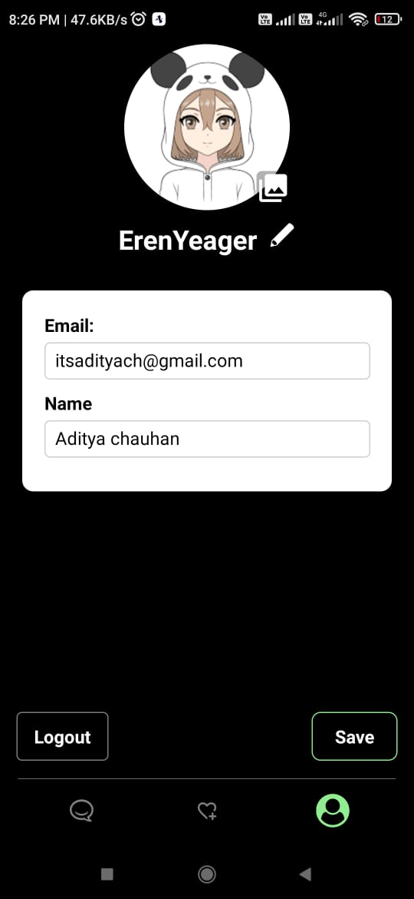

# VWatch

A brief description of your project.

## Table of Contents

- [Introduction](#introduction)
- [Features](#features)
- [Installation](#installation)
- [Usage](#usage)
- [Contributing](#contributing)
- [License](#license)

## Introduction

Introduce your project and provide some context. Mention the problem it aims to solve or the goals it tries to achieve.

## Features

List the key features of your project. This section can be a bulleted list or a table.

- Feature 1
- Feature 2
- Feature 3

## Installation

Provide step-by-step instructions on how to install your project.

1. First, clone this repository.
2. Navigate to the project folder.
3. Run `npm install` to install the dependencies.

## Usage

Explain how to use your project or how to get started with it.

Example command to run the project:
